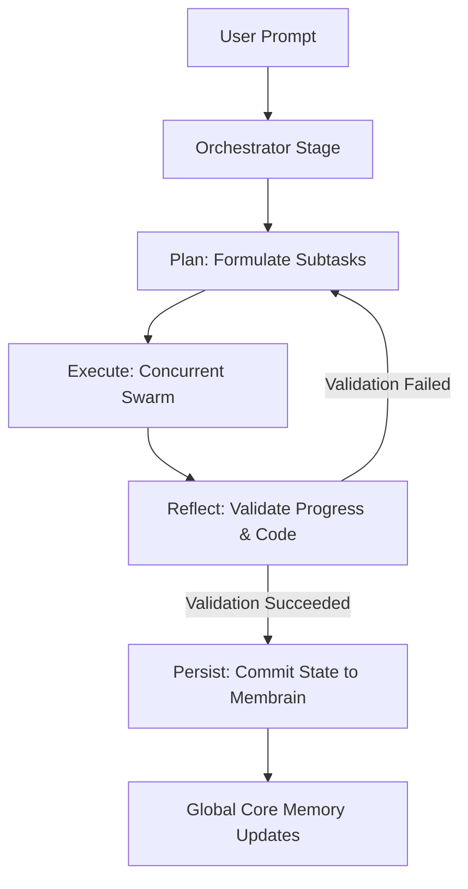

# Kognisant 🧠 - Comprehensive User Manual

Welcome to **Kognisant**! Kognisant is an autonomous, self-evolving, model-agnostic software engineering copilot and multi-agent framework. By leveraging a dual-memory system - local **Membrain** project context and global **Core Memory** universal skills - Kognisant operates as a "compiled system," marrying static verification, persistent long-term state tracking, and parallel autonomous swarms.

This manual provides an exhaustive guide to installing, configuring, and interacting with Kognisant.

---

## Table of Contents
1. [Core Philosophy & Architecture](#1-core-philosophy--architecture)
2. [Installation Guide](#2-installation-guide)
3. [Workspace Initialization & Membrain](#3-workspace-initialization--membrain)
4. [The Interactive Chat Interface (`kognisant chat`)](#4-the-interactive-chat-interface-kognisant-chat)
5. [Autonomous Swarms & PERP Architecture](#5-autonomous-swarms--perp-architecture)
6. [Universal Transferable Skills & Custom Tools](#6-universal-transferable-skills--custom-tools)
7. [The `/tool` Management Wizard](#7-the-tool-management-wizard)
8. [Spec-Driven Development (SDD) Command](#8-spec-driven-development-sdd-command)
9. [Hardened Safety & System Boundaries](#9-hardened-safety--system-boundaries)
10. [Troubleshooting & Support](#10-troubleshooting--support)
11. [Schema Versioning](#11-schema-versioning)
12. [Timeouts & Exit Behavior](#12-timeouts--exit-behavior)
13. [Scheduler Policy](#13-scheduler-policy)
14. [Security & Secrets](#14-security--secrets)
15. [Cron Scheduling](#15-cron-scheduling)
16. [Daemon & Background Jobs](#16-daemon--background-jobs)
17. [World Model and Goal Generation](#17-world-model-and-goal-generation)

---

## 1. Core Philosophy & Architecture

Most AI coding tools operate in a vacuum - they forget what you built as soon as you clear your chat or open a new session. Kognisant solves this by compiling and persisting context dynamically. It treats software engineering as a continuous state machine:



Kognisant maintains two distinct boundaries:
*   **The Project Membrain (`.kognisant/`)**: Local long-term memory that keeps track of active milestones, checklists, and codebase structure. It ensures that any agent starting a subtask knows exactly what has already been built.
*   **The Core Memory (`~/.kognisant_core/`)**: Global, transferable intelligence that lives in your home directory. It holds universal coding standards, web-browsing skills, and custom dynamic tools that scale across all of your software projects.

---

## 2. Installation Guide

Kognisant is distributed as a free-to-use, zero-dependency command-line utility. To ensure simple updates and portability, it is distributed **exclusively via the Python Pip package manager**.

### System Requirements
*   **Python**: Version `3.10` or newer (Python `3.12` recommended).
*   **Operating System**: macOS, Linux (POSIX-compliant only). **Windows is not supported** - see [Platform Requirements](#platform-requirements) below.
*   **Web Scraping Engine** (Optional but highly recommended): Standard Google Chrome or Brave Browser installed on your machine for headless background web browsing and DOM rendering.

### Platform Requirements

The Autonomous Execution Engine (daemon, background jobs, job scheduling) supports **POSIX-compliant operating systems only**:

- ✅ **Linux** (all major distributions)
- ✅ **macOS** (10.15 Catalina and later)
- ❌ **Windows** - not supported (including WSL for daemon features)

The execution engine requires the following POSIX-specific system calls:

| Requirement | Purpose |
| :--- | :--- |
| `fcntl.flock()` | Advisory file locking for concurrent job queue access |
| `os.fork()` | Daemon process creation (background execution) |
| `os.setsid()` | Session isolation for the daemon child process |
| `os.closerange()` | File descriptor cleanup in forked processes |

If you attempt to import the daemon module on a non-POSIX platform, Kognisant raises a `RuntimeError` with a clear message indicating the platform is unsupported.

> **Note:** The interactive chat interface (`kognisant chat`) and other non-daemon features work on all platforms. Only the background execution engine has the POSIX requirement.

### In-Place Installation
Open your terminal and run the standard pip installer:

```bash
pip install --upgrade cli-kognisant
```

To verify the installation was successful and inspect the CLI version, run:

```bash
kognisant --help
```

---

## 3. Workspace Initialization & Membrain

To start collaborating with Kognisant, you must initialize your active project directory. This scaffolds Kognisant's persistent local memory.

Navigate to your project root folder and execute:

```bash
kognisant init
```

### What Happens Under the Hood?
Upon running `init`, Kognisant configures the local workspace boundary:
1.  **Creates `.kognisant/`**: The local configuration and history repository.
2.  **Scaffolds `.kognisant/config.json`**: Sets up workspace-specific options, including active exclude patterns (like `.git`, `node_modules`, `__pycache__`, and virtual environments) to keep the context clean.
3.  **Compiles `.kognisant/context.md`**: This is the primary **Membrain** file. It stores project-level milestones, active development phases, and structural maps.
4.  **Enforces `.kognisant/memory-guidlines.md`**: Establishes strict rules guiding how agents can interact with and update files.
5.  **Registers Project Globally**: Automatically links the absolute path of this project with `~/.kognisant_core/projects.json` so your global assistant remains aware of your active workspaces.
The global assistant remains aware of your active workspaces. Kognisant now supports multiple API protocols natively, including **OpenAI**, **Ollama Native**, and **Llama.cpp Native**.

---

## 4. The Interactive Chat Interface (`kognisant chat`)

To start a session with Kognisant, simply execute:

```bash
kognisant chat
```

On startup, Kognisant auto-detects your local environment, syncs active model configs, and initializes a beautiful interactive prompt. 

### Model selection & Config Wizard
If multiple models or providers are configured in your global model pool (`~/.kognisant_core/models_pool.json`), Kognisant prompts you with an interactive selection menu on launch, showing:
*   Local Ollama models (via native `/api/chat` or OpenAI-compatible endpoints).
*   Llama.cpp servers (via native `/completion` or `/v1/chat/completions`).
*   Cloud endpoints (OpenAI, DeepSeek, Anthropic, or any custom OpenAI-compatible endpoint).

### Supported API Protocols
Kognisant is built to be truly model-agnostic. You can configure the `protocol` field in your `models_pool.json`:
*   `openai`: The standard for most cloud and local wrappers.
*   `ollama`: Uses Ollama's native high-performance chat API.
*   `llama_cpp`: Supports Llama.cpp's native server API, including automatic conversion of chat messages to formatted prompts.

---

### In-Chat Slash Commands
Kognisant provides an extensive suite of in-chat commands to inspect state, switch configurations, or deploy autonomous background workers.

| Command | Usage | Description |
| :--- | :--- | :--- |
| `/help` | `/help` | Displays Kognisant's beautiful, spacious command help matrix. |
| `/context` | `/context` | Renders the project's local **Membrain** (`context.md`), displaying current tasks and checklist state. |
| `/skills` | `/skills` | Renders the list of universal, global transferable skills currently loaded. |
| `/files` | `/files` | Lists all indexed, non-excluded files inside your project workspace root. |
| `/read` | `/read <file_path>` | Injects the full text content of a specific file straight into conversational memory. |
| `/model` | `/model` | Opens the Model Wizard on the fly to switch active models or register custom endpoints. |
| `/providers` | `/providers` | Inspects configured AI providers, pricing structures, and API keys. |
| `/agent` | `/agent <task>` | Spawns a concurrent, background **PERP Swarm** to solve a complex coding task. |
| `/tool` | `/tool <subcommand>` | Opens the global tool management wizard (list, register, delete global tools). |
| `/paste` / `/p` | `/paste` | Opens secure paste mode. Type `/end` on a blank line to submit large log traces. |
| `/goals` | `/goals` | Lists active World Model improvement goals (requires world_model_enabled). |
| `/goals accept` | `/goals accept <id>` | Accept a goal for automatic execution. |
| `/goals dismiss` | `/goals dismiss <id>` | Dismiss a goal and record negative feedback for learning. |
| `/jobs` | `/jobs` | Lists all background jobs with name, type, state, run count, exit code, next run, and PID. |
| `/job stop` | `/job stop <name>` | Send SIGTERM to running subprocess, set state to "cancelled". |
| `/job logs` | `/job logs <name>` | View last 30 lines of job output. |
| `/job restart` | `/job restart <name>` | Restart a stopped or crash-looped persistent job. |
| `/job remove` | `/job remove <name>` | Permanently remove a job from the queue (terminates if running). |
| `/daemon status` | `/daemon status` | Show daemon running state, PID, and uptime. |
| `/daemon start` | `/daemon start` | Start the background daemon process. |
| `/daemon stop` | `/daemon stop` | Stop the running daemon (sends SIGTERM). |
| `/daemon restart` | `/daemon restart` | Stop and restart the daemon in one step. |
| `/worldmodel` | `/worldmodel [enable\|disable\|status]` | Manage the World Model subsystem (enable, disable, or check status). |
| `/clear` | `/clear` | Flushes active session conversational logs, starting fresh while preserving system prompts. |
| `exit` / `quit` | `exit` | Safely terminates your session, saves logs to `.kognisant/history/`, and exits. |

---

## 5. Autonomous Swarms & PERP Architecture

When you issue a complex command (either via `/agent <task>` or during autonomous execution), Kognisant deploys a **PERP Swarm** (Plan, Execute, Reflect, Persist).

Unlike standard sequential agents that guess their way through code, a Kognisant Swarm operates under strict, state-machine stages:

1.  **PLAN (Planning Stage)**: The orchestrator model decomposes your high-level goal into disjoint, well-scoped subtasks. These subtasks are structured with rigorous criteria.
2.  **EXECUTE (Execution Stage)**: Kognisant deploys a thread-safe execution swarm. Tasks are executed in parallel on a background thread queue, managed via local semaphores to regulate system CPU load.
3.  **REFLECT (Reflection Stage)**: A dedicated Reflection Agent reviews modified files, inspects stdout/stderr metrics, and compares results against the original goals. If validation fails, it generates correction loops and retries.
4.  **PERSIST (Persistence Stage)**: Once fully validated, changes are committed to the disk, and the project's `.kognisant/context.md` is updated.

---

## 6. Universal Transferable Skills & Custom Tools

Kognisant's true superpower lies in its ability to self-evolve. By separating global core competence from workspace-specific tasks, Kognisant lets you define **Global Skills** and **Global Tools**.

### Location Directories
Global assets live in your user home folder and are shared across all of your codebases:
*   **Skills folder**: `~/.kognisant_core/skills/`
*   **Tools folder**: `~/.kognisant_core/tools/`

### Built-in Global Skills
*   **`web_browser_steering.md`**: Teaches Kognisant when to run DuckDuckGo background searches silently, fetch DOM headlessly, or capture user developer consoles.
*   **`coding_standards.md`**: Guides modular structures, clean coding patterns, and exception handling.
*   **`global_tool_development.md`**: The strict guidelines and execution contracts Kognisant follows to build new tools in Python.

### Built-in Global Tools
*   **`search_web`**: Headless background DuckDuckGo scraper.
*   **`browse_web_page`**: Direct URL DOM renderer.
*   **`open_in_native_browser`**: Launches desktop searches visually.
*   **`capture_active_browser_console`**: Captures live Chrome/Brave browser console streams for front-end debugging.
*   **`shell_execution`**: Run terminal shell commands with safety timeouts and error indicators.

---

### Creating Your Own Custom Global Tool
You can write custom tools yourself (or have Kognisant write them for you)! Every global tool requires exactly two files saved side-by-side in `~/.kognisant_core/tools/`:

#### 1. The Schema File (`~/.kognisant_core/tools/<tool_name>.json`)
Defines the tool calling specifications in standard OpenAI function calling format.

*Example `my_calculator.json`:*
```json
{
  "type": "function",
  "function": {
    "name": "my_calculator",
    "description": "Perform basic arithmetic operations globally.",
    "parameters": {
      "type": "object",
      "properties": {
        "operation": {
          "type": "string",
          "enum": ["add", "subtract", "multiply", "divide"]
        },
        "x": { "type": "number" },
        "y": { "type": "number" }
      },
      "required": ["operation", "x", "y"]
    }
  }
}
```

#### 2. The Python Implementation File (`~/.kognisant_core/tools/<tool_name>.py`)
Kognisant dynamically executes dynamic tools as an isolated subprocess. Your script **must** follow this strict contract:
1.  **Arguments Ingest**: Arguments are passed as a single JSON string in `sys.argv[1]`.
2.  **No Interactive Inputs**: The script must never wait or prompt for user inputs.
3.  **Result Return**: Print the final output directly to standard output (`stdout`).

*Example `my_calculator.py`:*
```python
import sys
import json

def main():
    try:
        # 1. Parse arguments from sys.argv[1]
        args = json.loads(sys.argv[1])
        op = args.get("operation")
        x = float(args.get("x"))
        y = float(args.get("y"))
    except Exception as e:
        print(f"[Error] Failed to parse inputs: {e}")
        sys.exit(1)

    # 2. Execute calculation
    if op == "add":
        result = x + y
    elif op == "subtract":
        result = x - y
    elif op == "multiply":
        result = x * y
    elif op == "divide":
        result = x / y if y != 0 else "[Error] Division by zero"
    else:
        result = "[Error] Unknown operation"

    # 3. Print output directly to stdout
    print(f"Calculated: {result}")

if __name__ == "__main__":
    main()
```

---

## 7. The `/tool` Management Wizard

To manage, list, register, or remove global tools interactively during your chat sessions, use the `/tool` command.

```
  ⚙️  KOGNISANT GLOBAL TOOL UTILITY
  ────────────────────────────────────────────────
    /tool list                   - List all active global tools and schemas
    /tool register <name> <py_path> [json_path]
                                 - Register/copy a local Python script and schema to core
    /tool delete <name>         - Permanently delete a global tool and its schema
  ────────────────────────────────────────────────
```

### Listing Installed Global Tools
To inspect what dynamic capabilities your AI assistant currently possesses, type:

```bash
/tool list
```

### Registering a Workspace Tool Globally
If you or your local AI assistant wrote a cool script in your current project workspace (e.g., `scripts/optimize_png.py`), you can register and elevate it into a universal global core tool by running:

```bash
/tool register optimize_png scripts/optimize_png.py
```
This automatically copies your script to `~/.kognisant_core/tools/optimize_png.py` and scaffolds a matching `.json` schema template for you!

---

## 8. Spec-Driven Development (SDD) Command

Kognisant supports **Spec-Driven Development** natively through the `spec` CLI command. It compiles high-level Markdown specifications into precise execution agreements (`spec.json`), preventing scope-creep during autonomous runs.

### Command Guide
*   **Scaffold a New Feature Specification**:
    ```bash
    kognisant spec auth_module
    ```
    This automatically creates `.kognisant/specs/auth_module/` pre-populated with three files:
    *   `requirements.md` (What Kognisant must build).
    *   `design.md` (API contracts, boundaries, and files to touch).
    *   `tasks.md` (Checkbox checklists Kognisant will tick off).

*   **List Existing Specifications**:
    To inspect all compiled specs in your workspace, run:
    ```bash
    kognisant spec -l
    ```

---

## 9. Hardened Safety & System Boundaries

Because Kognisant has access to terminal execution and global core directories, we have built rigorous safety rails to keep your filesystem protected.

### Safe Path Resolver (`resolve_safe_path`)
Whenever Kognisant executes any file I/O tool, the system intercepts the path. The target file is strictly validated against three safe, authorized zones:
1.  **The active workspace directory**.
2.  **The global core tools directory** (`~/.kognisant_core/tools/`).
3.  **The global core skills directory** (`~/.kognisant_core/skills/`).

If an agent attempts to target a system folder (like `/etc/passwd` or `~/.ssh/`) or uses directory traversal hacks (`../../../`), Kognisant instantly blocks the action and returns `[Error] Access denied`.

### Standalone Global File Tools
To ensure complete directory safety and prevent any agentic routing confusion, we have built dedicated, strictly global tools:
*   **`read_global_file`**
*   **`create_global_file`**
*   **`edit_global_file`**

These tools are hard-sandboxed at the engine level: they are **strictly forbidden** from reading, creating, or modifying anything outside `~/.kognisant_core/` folders, ensuring complete workspace separation.

### Transactional File Editing
Edits made via `edit_project_file` or `edit_global_file` utilize atomic safety procedures. A backup file (`.bak`) is written to disk before edits run. If an edit fails, the engine automatically rolls back to prevent code corruption.

---

## 10. Troubleshooting & Support

### Diagnostic Logs
If Kognisant encounters an unexpected terminal or network error, it automatically writes a diagnostic stack trace to:
`~/.kognisant_core/error.log`

### Model Does Not Support Tool Calling
If you configure a small, local Ollama model that does not understand tool calling arguments, Kognisant automatically intercepts the error, gracefully downgrades your active session to standard text chat mode, and notifies you.

### Common Solutions
*   **Browser Scraping Fails**: Ensure Chrome or Brave is installed in `/Applications/` (macOS) or is present in your system `PATH` (Linux/Windows).
*   **Pip Upgrade Issues**: If pip caching serves stale versions, reinstall cleanly using:
    ```bash
    pip install --no-cache-dir --upgrade cli-kognisant
    ```

---

## 11. Schema Versioning

The jobs file (`~/.kognisant_core/jobs.json`) uses a versioned format to support safe schema evolution:

```json
{
  "schema_version": 1,
  "jobs": [...]
}
```

### How It Works

- Every write to `jobs.json` includes a top-level `schema_version` integer field
- On load, Kognisant validates the version number before processing
- If the version is recognized and current, the file is processed normally
- If the version is recognized but older, automatic forward-migration is applied

### Unrecognized Versions - Hard Failure

If `jobs.json` contains a `schema_version` higher than what your installed Kognisant version understands, the system **refuses to process the file** and raises an error:

```
Error: Unknown schema version 5. Refusing to process. This file may be from a newer version of Kognisant.
```

This prevents silent data corruption from incompatible format changes.

### Legacy Format Migration

If Kognisant encounters a bare JSON array (the old pre-versioned format), it automatically wraps it into the versioned structure with `schema_version: 1` using the atomic write path.

### Adding Migrations

Migrations are registered via `MigrationRegistry` in `jobs.py`. Each migration transforms data from version N to N+1:

```python
@MigrationRegistry.register(from_version=1)
def migrate_v1_to_v2(data: dict) -> dict:
    for job in data["jobs"]:
        job.setdefault("new_field", default_value)
    data["schema_version"] = 2
    return data
```

Each migration step uses the atomic write path, so pre-migration state is preserved in the `.bak` backup file.

---

## 12. Timeouts & Exit Behavior

Kognisant enforces timeout limits to prevent runaway processes:

| Context | Timeout | Description |
| :--- | :--- | :--- |
| Scheduled job execution | 3600 seconds (1 hour) | Maximum wall-clock time for a single cron job run |
| Agent job execution | 1800 seconds (30 min) | Maximum time for a PERP orchestration task |
| Lock acquisition | 5 seconds | Time to acquire the advisory file lock on `jobs.lock` |
| Graceful shutdown | 10 seconds per process | After SIGTERM, time before SIGKILL is sent |
| Follow mode polling | 500 milliseconds | Interval between log file checks in `--follow` mode |

### Persistent Job Exit Behavior

For persistent (long-running) jobs:
- **`exit(0)` = intentional completion** - the daemon treats this as the script completing successfully and does **not** restart it. The job state becomes "completed".
- **`exit(non-zero)` = crash** - the daemon auto-restarts the job after a 5-second delay (subject to crash loop detection).

---

## 13. Scheduler Policy

The `scheduler_policy` field controls how the daemon handles missed job executions after a system clock jump (e.g., after suspend/resume or NTP corrections).

### Available Policies

| Policy | Behavior | Default |
| :--- | :--- | :--- |
| `skip` | Missed executions during the clock jump period are silently discarded | ✅ Yes |
| `catchup_once` | Each missed job fires exactly once, regardless of how many intervals were skipped | No |

### How Clock Jumps Are Detected

The daemon uses `time.monotonic()` internally. If the elapsed monotonic time between poll cycles exceeds 30 seconds (2× the 15-second poll interval), a clock jump is declared.

### Setting the Policy

The `scheduler_policy` field is part of the job definition. It defaults to `"skip"` if not specified:

```bash
# The default behavior - skip missed executions
kognisant job add --name backup --script backup.py --type scheduled --cron "0 3 * * *"

# To enable catchup behavior, edit the job:
kognisant job edit backup --scheduler-policy catchup_once
```

---

## 14. Security & Secrets

### Environment Variable Storage

Environment variables configured for jobs are stored **in plaintext** in `~/.kognisant_core/jobs.json`. The system is **NOT a secrets manager**.

What this means:
- Any process running under the same user account can read `jobs.json`
- The file is protected with `chmod 600` (owner read/write only), so other system users cannot access it
- Do not store highly sensitive credentials directly in job env vars if you share the machine

### Recommended: Use `--env-file` with Restricted Permissions

For sensitive values (API keys, tokens, database passwords), use a separate env file:

```bash
# Create your secrets file
echo "API_KEY=sk-abc123" > ~/.secrets/my-bot.env
chmod 600 ~/.secrets/my-bot.env

# Reference it when creating the job
kognisant job add --name my-bot --script bot.py --type persistent --env-file ~/.secrets/my-bot.env
```

The env file format is `KEY=VALUE` per line, with `#` for comments and blank lines ignored.

### File Permission Enforcement

| File | Permissions | Purpose |
| :--- | :--- | :--- |
| `jobs.json` | `0o600` | Job queue with env vars |
| `jobs.json.bak` | `0o600` | Backup snapshot |
| Env files (recommended) | `0o600` | Secret environment variables |

### Root Privilege Warning

If you start the daemon as root (`euid == 0`), Kognisant displays a warning:

```
Warning: Daemon running with root privileges. Recommend running under a non-root user.
```

Running as a non-root user is strongly recommended.

---

## 15. Cron Scheduling

All cron expressions in Kognisant are evaluated in **UTC** (Coordinated Universal Time).

### 5-Field Format

```
┌───────────── minute (0-59)
│ ┌───────────── hour (0-23)
│ │ ┌───────────── day of month (1-31)
│ │ │ ┌───────────── month (1-12)
│ │ │ │ ┌───────────── day of week (0-6, Sunday=0)
│ │ │ │ │
* * * * *
```

### Supported Syntax

| Symbol | Meaning | Example |
| :--- | :--- | :--- |
| `*` | Every value | `* * * * *` (every minute) |
| `,` | List | `0,30 * * * *` (at :00 and :30) |
| `-` | Range | `9-17 * * * *` (hours 9 through 17) |
| `/` | Step | `*/5 * * * *` (every 5 minutes) |

### Examples

```bash
# Every day at 2:00 AM UTC
kognisant job add --name backup --script backup.py --type scheduled --cron "0 2 * * *"

# Every Monday at 9:00 AM UTC
kognisant job add --name weekly-report --script report.py --type scheduled --cron "0 9 * * 1"

# Every 15 minutes
kognisant job add --name health-check --script check.py --type scheduled --cron "*/15 * * * *"
```

### Unmatchable Expression Warning

If you create a job with a cron expression that cannot produce a valid next execution within 366 days (e.g., February 31st), Kognisant warns you:

```
Error: validation - Cron expression '0 0 31 2 *' may never produce a match within 366 days
Do you want to create this job anyway? [y/N]
```

### Displayed Timestamps

All displayed timestamps for `next_run_at` and `last_run_at` include a "UTC" suffix:

```
  nightly-tests   scheduled  scheduled  Run# 5   Exit 0   2025-06-15T02:00 UTC   in 8h 30m (2025-06-16T02:00 UTC)
```

---

## 16. Daemon & Background Jobs

Kognisant includes a built-in background daemon that can run scripts autonomously - bots, cron jobs, monitoring tasks, and AI agent work - without keeping a terminal open.

> **Note:** The daemon requires a POSIX-compliant system (Linux or macOS). See [Platform Requirements](#platform-requirements).

### Starting & Stopping the Daemon

The daemon is a forked background process that polls a job queue every 15 seconds.

```bash
# Start the daemon (forks to background)
kognisant daemon start

# Check if it's running
kognisant daemon status

# Restart the daemon (stop + start in one command)
kognisant daemon restart

# View daemon operational logs
kognisant daemon logs

# Stop the daemon gracefully (sends SIGTERM, waits for jobs to finish)
kognisant daemon stop
```

When the daemon stops, it sends SIGTERM to all running job subprocesses, waits up to 10 seconds for each to exit, then sends SIGKILL if needed. The PID file is cleaned up on exit.

### CLI Commands Reference

#### `kognisant daemon restart`

Stops the running daemon (if any) and starts a fresh one. If the daemon is not running, starts it fresh and notifies you:

```bash
$ kognisant daemon restart
Daemon restarted with new PID 54321.

# Or if daemon wasn't running:
$ kognisant daemon restart
Daemon was not previously running. Started fresh with PID 54321.
```

#### `kognisant job remove <name>`

Permanently removes a job from the queue. If the job is currently running, its subprocess is terminated first:

```bash
$ kognisant job remove old-bot
Job 'old-bot' removed.
```

#### `kognisant job edit <name> [flags]`

Edit a job's configuration without removing and recreating it:

```bash
# Change cron schedule
kognisant job edit nightly-tests --cron "0 3 * * *"

# Update environment variables (merges with existing)
kognisant job edit my-bot --env API_KEY=new-key --env TIMEOUT=30

# Change the script
kognisant job edit my-bot --script new-bot.py
```

Flags:
- `--cron EXPR` - New cron expression (note: evaluated in UTC)
- `--env KEY=VALUE` - Set/update environment variable (repeatable)
- `--script PATH` - New script path (relative to `~/.kognisant_core/scripts/`)

If the job is currently running, you'll see a warning:
```
⚠️  Warning: Job 'my-bot' is currently running. Changes will take effect on the next execution cycle.
```

#### `kognisant job logs <name> --follow`

Continuously display new lines appended to a job's log file, similar to `tail -f`:

```bash
$ kognisant job logs my-bot --follow
[2025-06-15T10:30:01] Bot started successfully
[2025-06-15T10:30:02] Listening for messages...
^C
Follow mode stopped.
```

Checks for new content every 500ms. Press Ctrl+C to stop.

#### `kognisant job add --env-file PATH`

Load environment variables from a file instead of passing them inline:

```bash
kognisant job add --name my-bot --script bot.py --type persistent --env-file ~/.secrets/bot.env
```

The env file format:
```
# Comments are supported
API_KEY=sk-abc123
DB_URL=postgres://localhost/mydb
```

> **Security note:** Environment variables are stored in plaintext in `jobs.json`. The system is NOT a secrets manager. Use `--env-file` with `chmod 600` files for sensitive values.

### Chat Slash Commands for Jobs

From within `kognisant chat`, you can manage jobs and the daemon without leaving the session:

| Command | Description |
| :--- | :--- |
| `/jobs` | List all jobs with name, type, state, run count, exit code, next run, PID |
| `/job stop <name>` | Send SIGTERM to running subprocess, set state to "cancelled" |
| `/job logs <name>` | View last 30 lines of job output |
| `/job restart <name>` | Restart a stopped or crash-looped persistent job |
| `/job remove <name>` | Permanently remove job from queue (terminates if running) |
| `/daemon status` | Show daemon PID, uptime, and running state |
| `/daemon start` | Start the daemon from within chat |
| `/daemon stop` | Stop the running daemon (sends SIGTERM) |
| `/daemon restart` | Stop and restart the daemon in one step |

### Managing Jobs

Jobs are units of work stored in `~/.kognisant_core/jobs.json`. Each job has a name, type, and state.

```bash
# Add a scheduled job (runs on a cron schedule, times in UTC)
kognisant job add --name nightly-tests --script run-tests.py --type scheduled --cron "0 2 * * *"

# Add a persistent job (runs continuously, auto-restarts on crash)
kognisant job add --name telegram-bot --script telegram-bot.py --type persistent

# Add a job with environment variables from a file
kognisant job add --name my-bot --script bot.py --type persistent --env-file ~/.secrets/bot.env

# List all jobs with their current state, run count, exit code, and next run time
kognisant job list

# Cancel a running job (terminates the subprocess)
kognisant job cancel my-job

# Permanently remove a job from the queue
kognisant job remove my-job

# Edit a job's cron schedule
kognisant job edit my-job --cron "*/30 * * * *"

# View the last 50 lines of a job's output
kognisant job logs my-job

# Tail a job's log in real-time
kognisant job logs my-job --follow
```

### Script Management (AI-Created Scripts)

The AI agent creates and manages scripts in `~/.kognisant_core/scripts/`. Each script has:
- A `.py` file with the executable code
- A `.json` metadata sidecar with description, required env vars, and creation timestamp

Scripts follow a contract:
- **stdin**: Receives a JSON object with `{job_name, job_type, env_vars, timestamp}`
- **stdout**: Captured to `~/.kognisant_core/logs/{job_name}.log`
- **stderr**: Captured with `[ERROR]` prefix per line
- **exit 0**: Success | **exit non-zero**: Failure (triggers restart for persistent jobs)

### Job Types Explained

| Type | Behavior | Auto-Restart | Use Case |
| :--- | :--- | :--- | :--- |
| **scheduled** | Runs on a cron expression, exits after each run | No | Nightly tests, periodic reports |
| **persistent** | Runs continuously as a long-lived process | Yes (5s delay) | Telegram bots, Discord bots, monitoring |
| **agent** | One-shot PERP swarm task, completes when done | No | Complex autonomous coding tasks |

### Crash Loop Detection

Persistent jobs are automatically restarted when they exit with a non-zero code. However, if a job accumulates **more than 5 restarts within a rolling 60-second window**, the daemon marks it as `crash_loop` and stops restarting it.

To recover from a crash loop:
```
/job restart my-bot
```
This resets the restart counter and puts the job back in `pending` state.

### File System Layout

```
~/.kognisant_core/
├── daemon.pid          # PID of the running daemon process
├── daemon.log          # Daemon operational log (timestamped entries)
├── jobs.json           # Job queue (locked via jobs.lock for concurrency)
├── jobs.lock           # Advisory lock file (fcntl.flock)
├── logs/               # Per-job stdout/stderr output
│   ├── telegram-bot.log
│   ├── nightly-tests.log
│   └── refactor-task.log
├── scripts/            # AI-managed global scripts
│   ├── telegram-bot.py
│   ├── telegram-bot.json
│   ├── run-tests.py
│   └── run-tests.json
├── models_pool.json
├── skills/
└── tools/
```

---

## 17. World Model and Goal Generation

Kognisant includes a self-diagnostic subsystem called the World Model. When enabled, it maintains a dependency graph of your codebase, tracks confidence scores on its knowledge, and generates prioritized improvement goals automatically.

### Enabling the World Model

The World Model is disabled by default. To enable it for a project, add the `world_model_enabled` flag to your workspace config:

```json
// .kognisant/config.json
{
  "project_name": "my-project",
  "world_model_enabled": true,
  ...
}
```

Then initialize the world model directory structure:

```bash
kognisant chat
# Inside chat:
/agent Initialize world model for this project
```

Or it will initialize automatically on the first PERP swarm run when enabled.

### What the World Model Does

When enabled, the World Model:

1. **Traces PERP executions** - every tool call, file operation, and LLM call is recorded to `.kognisant/traces/`.
2. **Builds a dependency graph** - AST-based static analysis maps functions, classes, imports, and call sites with confidence scores.
3. **Detects changes** - git diff integration invalidates stale graph edges when code changes.
4. **Tracks test health** - pytest pass/fail trends are recorded. Unstable tests reduce confidence on connected code.
5. **Generates improvement goals** - six detection strategies identify contract violations, coverage gaps, complexity hotspots, stale artifacts, decay alerts, and repeated error patterns.
6. **Learns from your feedback** - acceptance and dismissal signals calibrate future goal generation.

### The /goals Command

When the World Model is enabled, a new `/goals` command becomes available in chat:

| Command | Description |
| :--- | :--- |
| `/goals` | List all active goals grouped by type with priority scores |
| `/goals accept <id>` | Accept a goal and queue it for execution |
| `/goals dismiss <id>` | Dismiss a goal (records negative feedback for learning) |

### Session-Start Goal Display

When you start a new chat session with the World Model enabled, Kognisant displays up to 3 top-priority active goals. This helps surface relevant improvements at the right time.

### Inline Contextual Suggestions

When you use `/read <file>` on a file that has associated active goals, Kognisant displays the highest-priority goal for that file as an inline suggestion.

### Goal Types

| Type | Trigger | What It Means |
| :--- | :--- | :--- |
| `contract_violation` | Function call arguments don't match expected signature | An interface contract between components may be broken |
| `coverage_gap` | Module has 4+ untested branches | Test coverage is insufficient in a module |
| `decay_alert` | Many beliefs pruned from a module in one cycle | Knowledge about a module is going stale |
| `complexity` | Cyclomatic complexity > 15 with high churn or no tests | A function is too complex and risky |
| `stale_artifact` | File unmodified 90+ days with low-confidence nodes | Code may be abandoned or outdated |
| `pattern_detection` | Same error repeated 3+ times in recent executions | A recurring failure pattern exists |

### Graduated Autonomy

Kognisant learns which goal types you tend to accept or dismiss:

- **Auto-execute** (acceptance rate > 85%) - goals are executed without asking
- **Ask** (between 20% and 85%) - goals are proposed for your approval
- **Suppress** (acceptance rate < 20%) - goals are hidden (periodically re-evaluated)

During the first 20 proposals (cold start mode), all goals require explicit confirmation.

### Daemon Integration

When the daemon is running and the World Model is enabled, three background maintenance jobs execute automatically:

- **decay_tick** - runs every 60 minutes when file modifications are detected. Applies localized confidence decay near changed code.
- **static_analysis** - polls git HEAD every 5 minutes. When HEAD changes, re-analyzes affected files.
- **generate_goals** - runs after successful decay_tick or static_analysis to check for new goals.

### Storage Layout

The World Model stores its data under `.kognisant/world_model/`:

```
.kognisant/
├── traces/                    # PERP execution traces (one JSON per session)
├── world_model/
│   ├── graph/
│   │   ├── index.json         # Node-to-shard mapping
│   │   ├── modules/           # Per-module JSON shards
│   │   └── cross_module.json  # Inter-module edges
│   ├── beliefs.json           # Confidence-tracked knowledge
│   ├── contracts.json         # Component interface contracts
│   ├── epistemic_gaps.json    # Known unknowns
│   ├── change_log.json        # Last known git HEAD
│   ├── test_health.json       # Rolling test results (last 20 runs)
│   └── snapshots/             # Pre-execution state snapshots
└── goals/
    ├── active.json            # Currently active goals
    ├── completed.json         # Historical completed/failed goals
    └── learning.json          # Feedback signals for autonomy calibration
```

Global autonomy configuration is stored at `~/.kognisant_core/autonomy_config.json`.

### Backward Compatibility

All World Model features are gated behind the `world_model_enabled` flag. Existing users who never set this flag will see zero changes in behavior. The TraceCollector records traces regardless (lightweight, no-op if traces directory is missing), but all graph operations, goal generation, and UI features only activate when explicitly enabled.

---
*Kognisant is open-source and free-to-use under the MIT License. Share, modify, and build universal agentic intelligence freely!*
