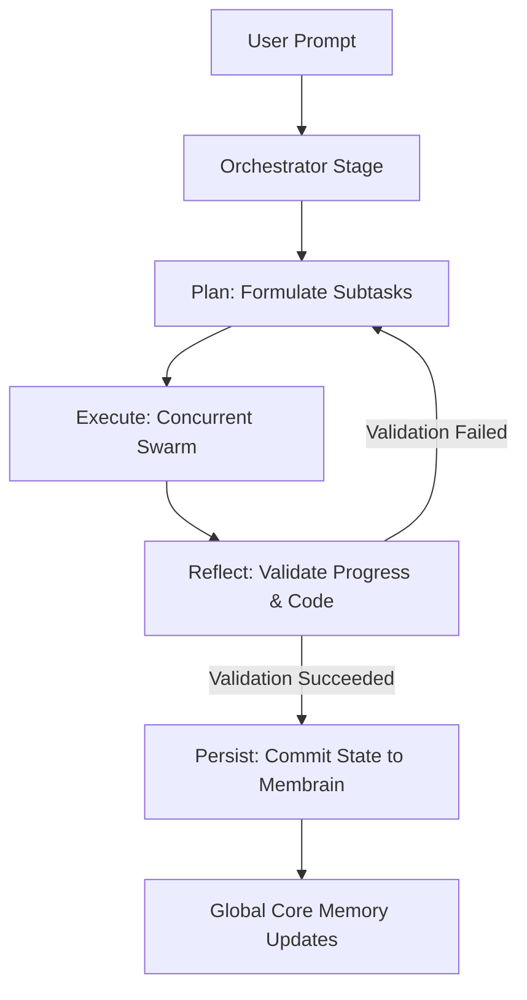

# Kognisant 🧠 — Comprehensive User Manual

Welcome to **Kognisant**! Kognisant is an autonomous, self-evolving, model-agnostic software engineering copilot and multi-agent framework. By leveraging a dual-memory system—local **Membrain** project context and global **Core Memory** universal skills—Kognisant operates as a "compiled system," marrying static verification, persistent long-term state tracking, and parallel autonomous swarms.

This manual provides an exhaustive guide to installing, configuring, and interacting with Kognisant.

---

## Table of Contents
1. [Core Philosophy & Architecture](#1-core-philosophy--architecture)
2. [Installation Guide](#2-installation-guide)
3. [Workspace Initialization & Membrain](#3-workspace-initialization--membrain)
4. [The Interactive Chat Interface (`kognisant chat`)](#4-the-interactive-chat-interface-kognisant-chat)
5. [Autonomous Swarms & PERP Architecture](#5-autonomous-swarms--perp-architecture)
6. [Universal Transferable Skills & Custom Tools](#6-universal-transferable-skills--custom-tools)
7. [The `/tool` Management Wizard](#7-the-tool-management-wizard)
8. [Spec-Driven Development (SDD) Command](#8-spec-driven-development-sdd-command)
9. [Hardened Safety & System Boundaries](#9-hardened-safety--system-boundaries)
10. [Troubleshooting & Support](#10-troubleshooting--support)

---

## 1. Core Philosophy & Architecture

Most AI coding tools operate in a vacuum—they forget what you built as soon as you clear your chat or open a new session. Kognisant solves this by compiling and persisting context dynamically. It treats software engineering as a continuous state machine:



Kognisant maintains two distinct boundaries:
*   **The Project Membrain (`.kognisant/`)**: Local long-term memory that keeps track of active milestones, checklists, and codebase structure. It ensures that any agent starting a subtask knows exactly what has already been built.
*   **The Core Memory (`~/.kognisant_core/`)**: Global, transferable intelligence that lives in your home directory. It holds universal coding standards, web-browsing skills, and custom dynamic tools that scale across all of your software projects.

---

## 2. Installation Guide

Kognisant is distributed as a free-to-use, zero-dependency command-line utility. To ensure simple updates and portability, it is distributed **exclusively via the Python Pip package manager**.

### System Requirements
*   **Python**: Version `3.8` or newer (Python `3.12` recommended).
*   **Operating System**: macOS, Linux, or Windows (WSL/Powershell).
*   **Web Scraping Engine** (Optional but highly recommended): Standard Google Chrome or Brave Browser installed on your machine for headless background web browsing and DOM rendering.

### In-Place Installation
Open your terminal and run the standard pip installer:

```bash
pip install --upgrade cli-kognisant
```

To verify the installation was successful and inspect the CLI version, run:

```bash
kognisant --help
```

---

## 3. Workspace Initialization & Membrain

To start collaborating with Kognisant, you must initialize your active project directory. This scaffolds Kognisant's persistent local memory.

Navigate to your project root folder and execute:

```bash
kognisant init
```

### What Happens Under the Hood?
Upon running `init`, Kognisant configures the local workspace boundary:
1.  **Creates `.kognisant/`**: The local configuration and history repository.
2.  **Scaffolds `.kognisant/config.json`**: Sets up workspace-specific options, including active exclude patterns (like `.git`, `node_modules`, `__pycache__`, and virtual environments) to keep the context clean.
3.  **Compiles `.kognisant/context.md`**: This is the primary **Membrain** file. It stores project-level milestones, active development phases, and structural maps.
4.  **Enforces `.kognisant/memory-guidlines.md`**: Establishes strict rules guiding how agents can interact with and update files.
5.  **Registers Project Globally**: Automatically links the absolute path of this project with `~/.kognisant_core/projects.json` so your global assistant remains aware of your active workspaces.

---

## 4. The Interactive Chat Interface (`kognisant chat`)

To start a session with Kognisant, simply execute:

```bash
kognisant chat
```

On startup, Kognisant auto-detects your local environment, syncs active model configs, and initializes a beautiful interactive prompt. 

### Model Selection & Config Wizard
If multiple models or providers are configured in your global model pool (`~/.kognisant_core/models_pool.json`), Kognisant prompts you with an interactive selection menu on launch, showing:
*   Local Ollama models (e.g., `gemma3:1b`).
*   Cloud endpoints (OpenAI, DeepSeek, Anthropic, or any custom OpenAI-compatible endpoint).

---

### In-Chat Slash Commands
Kognisant provides an extensive suite of in-chat commands to inspect state, switch configurations, or deploy autonomous background workers.

| Command | Usage | Description |
| :--- | :--- | :--- |
| `/help` | `/help` | Displays Kognisant's beautiful, spacious command help matrix. |
| `/context` | `/context` | Renders the project's local **Membrain** (`context.md`), displaying current tasks and checklist state. |
| `/skills` | `/skills` | Renders the list of universal, global transferable skills currently loaded. |
| `/files` | `/files` | Lists all indexed, non-excluded files inside your project workspace root. |
| `/read` | `/read <file_path>` | Injects the full text content of a specific file straight into conversational memory. |
| `/model` | `/model` | Opens the Model Wizard on the fly to switch active models or register custom endpoints. |
| `/providers` | `/providers` | Inspects configured AI providers, pricing structures, and API keys. |
| `/agent` | `/agent <task>` | Spawns a concurrent, background **PERP Swarm** to solve a complex coding task. |
| `/tool` | `/tool <subcommand>` | Opens the global tool management wizard (list, register, delete global tools). |
| `/paste` / `/p` | `/paste` | Opens secure paste mode. Type `/end` on a blank line to submit large log traces. |
| `/clear` | `/clear` | Flushes active session conversational logs, starting fresh while preserving system prompts. |
| `exit` / `quit` | `exit` | Safely terminates your session, saves logs to `.kognisant/history/`, and exits. |

---

## 5. Autonomous Swarms & PERP Architecture

When you issue a complex command (either via `/agent <task>` or during autonomous execution), Kognisant deploys a **PERP Swarm** (Plan, Execute, Reflect, Persist).

Unlike standard sequential agents that guess their way through code, a Kognisant Swarm operates under strict, state-machine stages:

1.  **PLAN (Planning Stage)**: The orchestrator model decomposes your high-level goal into disjoint, well-scoped subtasks. These subtasks are structured with rigorous criteria.
2.  **EXECUTE (Execution Stage)**: Kognisant deploys a thread-safe execution swarm. Tasks are executed in parallel on a background thread queue, managed via local semaphores to regulate system CPU load.
3.  **REFLECT (Reflection Stage)**: A dedicated Reflection Agent reviews modified files, inspects stdout/stderr metrics, and compares results against the original goals. If validation fails, it generates correction loops and retries.
4.  **PERSIST (Persistence Stage)**: Once fully validated, changes are committed to the disk, and the project's `.kognisant/context.md` is updated.

---

## 6. Universal Transferable Skills & Custom Tools

Kognisant's true superpower lies in its ability to self-evolve. By separating global core competence from workspace-specific tasks, Kognisant lets you define **Global Skills** and **Global Tools**.

### Location Directories
Global assets live in your user home folder and are shared across all of your codebases:
*   **Skills folder**: `~/.kognisant_core/skills/`
*   **Tools folder**: `~/.kognisant_core/tools/`

### Built-in Global Skills
*   **`web_browser_steering.md`**: Teaches Kognisant when to run DuckDuckGo background searches silently, fetch DOM headlessly, or capture user developer consoles.
*   **`coding_standards.md`**: Guides modular structures, clean coding patterns, and exception handling.
*   **`global_tool_development.md`**: The strict guidelines and execution contracts Kognisant follows to build new tools in Python.

### Built-in Global Tools
*   **`search_web`**: Headless background DuckDuckGo scraper.
*   **`browse_web_page`**: Direct URL DOM renderer.
*   **`open_in_native_browser`**: Launches desktop searches visually.
*   **`capture_active_browser_console`**: Captures live Chrome/Brave browser console streams for front-end debugging.
*   **`shell_execution`**: Run terminal shell commands with safety timeouts and error indicators.

---

### Creating Your Own Custom Global Tool
You can write custom tools yourself (or have Kognisant write them for you)! Every global tool requires exactly two files saved side-by-side in `~/.kognisant_core/tools/`:

#### 1. The Schema File (`~/.kognisant_core/tools/<tool_name>.json`)
Defines the tool calling specifications in standard OpenAI function calling format.

*Example `my_calculator.json`:*
```json
{
  "type": "function",
  "function": {
    "name": "my_calculator",
    "description": "Perform basic arithmetic operations globally.",
    "parameters": {
      "type": "object",
      "properties": {
        "operation": {
          "type": "string",
          "enum": ["add", "subtract", "multiply", "divide"]
        },
        "x": { "type": "number" },
        "y": { "type": "number" }
      },
      "required": ["operation", "x", "y"]
    }
  }
}
```

#### 2. The Python Implementation File (`~/.kognisant_core/tools/<tool_name>.py`)
Kognisant dynamically executes dynamic tools as an isolated subprocess. Your script **must** follow this strict contract:
1.  **Arguments Ingest**: Arguments are passed as a single JSON string in `sys.argv[1]`.
2.  **No Interactive Inputs**: The script must never wait or prompt for user inputs.
3.  **Result Return**: Print the final output directly to standard output (`stdout`).

*Example `my_calculator.py`:*
```python
import sys
import json

def main():
    try:
        # 1. Parse arguments from sys.argv[1]
        args = json.loads(sys.argv[1])
        op = args.get("operation")
        x = float(args.get("x"))
        y = float(args.get("y"))
    except Exception as e:
        print(f"[Error] Failed to parse inputs: {e}")
        sys.exit(1)

    # 2. Execute calculation
    if op == "add":
        result = x + y
    elif op == "subtract":
        result = x - y
    elif op == "multiply":
        result = x * y
    elif op == "divide":
        result = x / y if y != 0 else "[Error] Division by zero"
    else:
        result = "[Error] Unknown operation"

    # 3. Print output directly to stdout
    print(f"Calculated: {result}")

if __name__ == "__main__":
    main()
```

---

## 7. The `/tool` Management Wizard

To manage, list, register, or remove global tools interactively during your chat sessions, use the `/tool` command.

```
  ⚙️  KOGNISANT GLOBAL TOOL UTILITY
  ────────────────────────────────────────────────
    /tool list                   - List all active global tools and schemas
    /tool register <name> <py_path> [json_path]
                                 - Register/copy a local Python script and schema to core
    /tool delete <name>         - Permanently delete a global tool and its schema
  ────────────────────────────────────────────────
```

### Listing Installed Global Tools
To inspect what dynamic capabilities your AI assistant currently possesses, type:

```bash
/tool list
```

### Registering a Workspace Tool Globally
If you or your local AI assistant wrote a cool script in your current project workspace (e.g., `scripts/optimize_png.py`), you can register and elevate it into a universal global core tool by running:

```bash
/tool register optimize_png scripts/optimize_png.py
```
This automatically copies your script to `~/.kognisant_core/tools/optimize_png.py` and scaffolds a matching `.json` schema template for you!

---

## 8. Spec-Driven Development (SDD) Command

Kognisant supports **Spec-Driven Development** natively through the `spec` CLI command. It compiles high-level Markdown specifications into precise execution agreements (`spec.json`), preventing scope-creep during autonomous runs.

### Command Guide
*   **Scaffold a New Feature Specification**:
    ```bash
    kognisant spec auth_module
    ```
    This automatically creates `.kognisant/specs/auth_module/` pre-populated with three files:
    *   `requirements.md` (What Kognisant must build).
    *   `design.md` (API contracts, boundaries, and files to touch).
    *   `tasks.md` (Checkbox checklists Kognisant will tick off).

*   **List Existing Specifications**:
    To inspect all compiled specs in your workspace, run:
    ```bash
    kognisant spec -l
    ```

---

## 9. Hardened Safety & System Boundaries

Because Kognisant has access to terminal execution and global core directories, we have built rigorous safety rails to keep your filesystem protected.

### Safe Path Resolver (`resolve_safe_path`)
Whenever Kognisant executes any file I/O tool, the system intercepts the path. The target file is strictly validated against three safe, authorized zones:
1.  **The active workspace directory**.
2.  **The global core tools directory** (`~/.kognisant_core/tools/`).
3.  **The global core skills directory** (`~/.kognisant_core/skills/`).

If an agent attempts to target a system folder (like `/etc/passwd` or `~/.ssh/`) or uses directory traversal hacks (`../../../`), Kognisant instantly blocks the action and returns `[Error] Access denied`.

### Standalone Global File Tools
To ensure complete directory safety and prevent any agentic routing confusion, we have built dedicated, strictly global tools:
*   **`read_global_file`**
*   **`create_global_file`**
*   **`edit_global_file`**

These tools are hard-sandboxed at the engine level: they are **strictly forbidden** from reading, creating, or modifying anything outside `~/.kognisant_core/` folders, ensuring complete workspace separation.

### Transactional File Editing
Edits made via `edit_project_file` or `edit_global_file` utilize atomic safety procedures. A backup file (`.bak`) is written to disk before edits run. If an edit fails, the engine automatically rolls back to prevent code corruption.

---

## 10. Troubleshooting & Support

### Diagnostic Logs
If Kognisant encounters an unexpected terminal or network error, it automatically writes a diagnostic stack trace to:
`~/.kognisant_core/error.log`

### Model Does Not Support Tool Calling
If you configure a small, local Ollama model that does not understand tool calling arguments, Kognisant automatically intercepts the error, gracefully downgrades your active session to standard text chat mode, and notifies you.

### Common Solutions
*   **Browser Scraping Fails**: Ensure Chrome or Brave is installed in `/Applications/` (macOS) or is present in your system `PATH` (Linux/Windows).
*   **Pip Upgrade Issues**: If pip caching serves stale versions, reinstall cleanly using:
    ```bash
    pip install --no-cache-dir --upgrade cli-kognisant
    ```

---
*Kognisant is open-source and free-to-use under the MIT License. Share, modify, and build universal agentic intelligence freely!*
